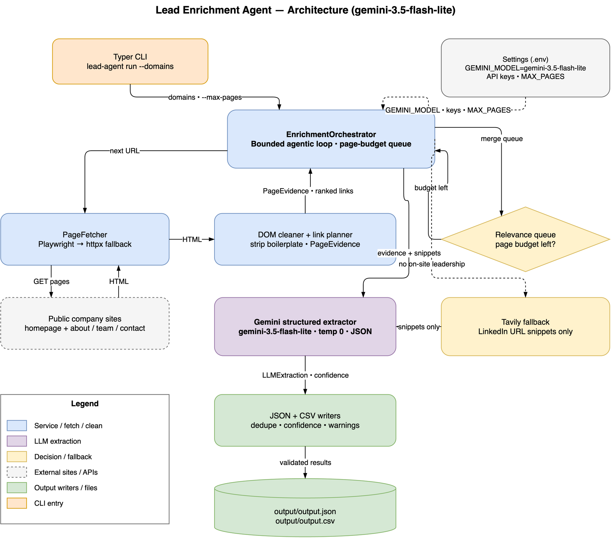

# Autonomous Lead Enrichment Agent

An evidence-first Python CLI that enriches public company domains into structured sales intelligence. It uses **Google Gemini 3.5 Flash-Lite** (`gemini-3.5-flash-lite`) for typed extraction and **Tavily** to find public LinkedIn result URLs when direct site evidence is incomplete.

The default model is `gemini-3.5-flash-lite`, configured via the `GEMINI_MODEL` environment variable.

## What it does

- Accepts and normalizes multiple domains from the CLI.
- Fetches a homepage and relevance-ranked internal pages (`about`, `team`, `contact`, `pricing`, etc.).
- Uses Playwright for JavaScript sites when installed; automatically falls back to `httpx` on browser failures.
- Removes scripts, styles, SVGs, navigation, footers, and other boilerplate before an LLM sees any content.
- Extracts a concise company overview, ICP, public emails, leadership, LinkedIn URLs, confidence, sources, and operational warnings with Pydantic-validated Gemini JSON.
- Uses Tavily only when on-site leadership evidence is lacking (customer/testimonial links don't count). If the first extraction still finds no company leaders, it searches once and re-extracts — bounded to one extra LLM call. It never scrapes LinkedIn.
- Verifies every leader before output: sources must be fetched pages or search hits, LinkedIn slugs must match the name, or the URL is dropped and confidence capped. Confidence is computed from evidence alone (max 0.9 — anything higher needs a human).
- Continues after page, search, browser, or model failures and emits partial results instead of crashing. Transient network errors are retried; HTTP error pages (404/403/bot-blockers) are recorded as warnings, not evidence.
- Tracks token usage, estimated USD cost (Flash-Lite tier), and LLM/search call counts per domain.

## Architecture



Typer CLI → bounded orchestrator loop → Playwright/httpx fetcher → DOM cleaner + link planner → Gemini 3.5 Flash-Lite structured extractor (Tavily leadership fallback) → JSON + CSV writers. Editable source: [`docs/architecture.drawio`](docs/architecture.drawio).

The controller is deliberately a bounded agentic loop: each fetched page yields candidate internal links, queues them by relevance, and continues until the page budget is spent. This is inspectable and deterministic rather than an unbounded browser agent.

## Setup

Requires Python 3.11+.

```bash
python -m venv .venv
source .venv/bin/activate
pip install -e '.[browser,dev]'
playwright install chromium
cp .env.example .env
```

Set these values in `.env`:

```dotenv
GEMINI_API_KEY=your_google_ai_studio_key
GEMINI_MODEL=gemini-3.5-flash-lite
TAVILY_API_KEY=your_tavily_key
```

`GEMINI_API_KEY` is required for LLM extraction. `TAVILY_API_KEY` is optional. Without either key, the program still runs and reports deterministic public-site evidence with an explicit warning.

## Run

```bash
lead-agent run \
  --domains postman.com --domains supabase.com --domains vapi.ai \
  --max-pages 6 \
  --search-enabled \
  --output output/output.json \
  --csv output/output.csv
```

Run tests and lint:

```bash
pytest
ruff check .
```

## Output

Each record includes `status` (`success`, `partial`, or `failed`), source pages, typed contact/leadership records, warnings, confidence, and cost metadata (`prompt_tokens`, `completion_tokens`, `total_tokens`, `estimated_cost_usd`, `llm_calls`, `search_calls`).

`output/` is gitignored and holds your local runs. `sample_output/output.json` and `sample_output/output.csv` are the committed examples for the three required domains (`postman.com`, `supabase.com`, `vapi.ai`) — regenerate both with your own keys immediately before submission so values remain current and evidence-backed, then copy them into `sample_output/`.

## Responsible use

This project processes public company pages and public search-result snippets. Respect sites’ terms, robots policies, rate limits, and applicable privacy/marketing laws. Do not use it to scrape protected LinkedIn content or to send unsolicited messages.
